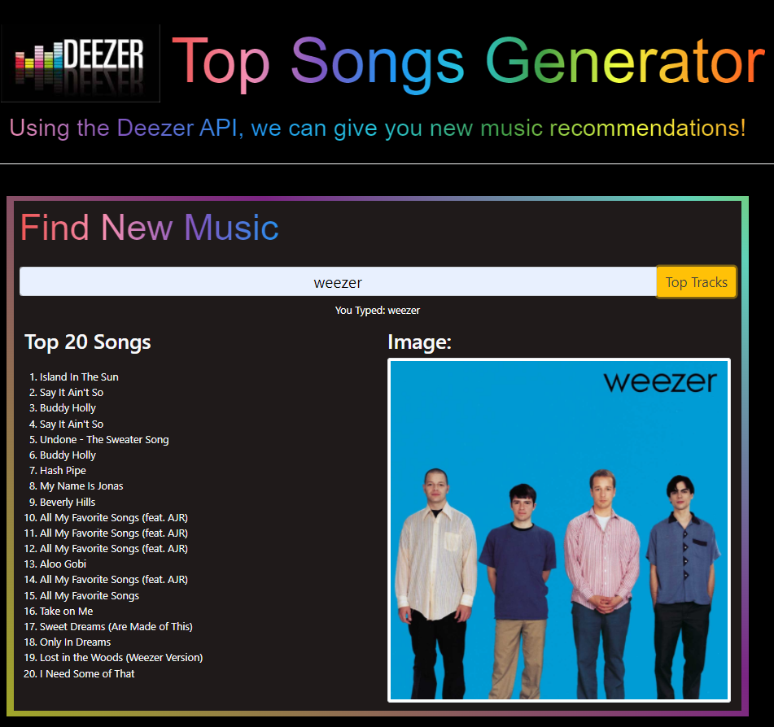

# Project One: Deezer New Music Generator

## User Story

```
As a music lover, I want to find the top tracks, albums and playlists for my favorite artist.
I WANT to enter my favorite artist 
SO THAT I can create a strong password that provides greater security
```

## Acceptance Criteria

```
1. When I enter a valid music artist name in the search bar and click top tracks, it displays the top 20 tracks from that artist.
2. When I enter a valid music artist name in the search bar and click top tracks, it displays an image.
3. When I enter a search term, it will save to local storage and appear as a selection the next time you search.
```

## Mock-Up

The following image shows the web application's appearance and functionality:



This layout is designed for desktop viewing, but optimized for mobile. 

URL: https://ginocorp.github.io/project-one-music-generator/

## References

Github: https://github.com/ginocorp/project-one-music-generator

Github Pages domain: https://ginocorp.github.io/project-one-music-generator/

Image Source for Deezer Header Logo https://seeklogo.com/images/D/deezer-logo-21B6DE6560-seeklogo.com.png

Image Source for Deezer Flavicon Logo: https://www.favicon.cc/?action=icon&file_id=514567

Deezer official API documentation: https://developers.deezer.com/api/search#connections

Rapid API documentation for Deezer Track Search: https://rapidapi.com/deezerdevs/api/deezer-1

Rapid API documentation for Google Image Search: https://rapidapi.com/Glavier/api/google-image-search1/
